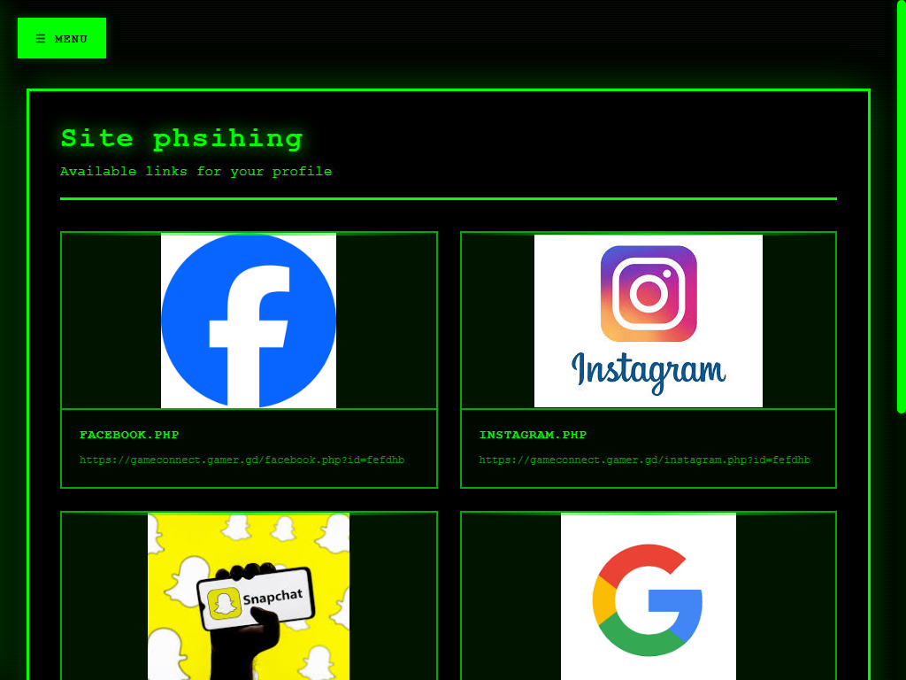

# GameConnect — Phishing Simulation & Social-Engineering Assessment Tool

**Project site:** [https://gameconnect.gamer.gd/](https://gameconnect.gamer.gd/)

---

## Overview

GameConnect is a controlled platform for simulating phishing and social-engineering scenarios **strictly for authorized security testing, training, and research**. The platform is built to help security teams measure human risk, evaluate awareness programs, and produce actionable reports to improve organizational resilience against fraud and credential-capture attacks.

> **Important:** This project is intended only for ethical, authorized use. Any unauthorized use, abuse, or attack against systems you do not own or without written consent is illegal and strictly prohibited. The authors and maintainers disclaim any responsibility for misuse.

---

## Key Features

* **Phishing link simulation** — create non-malicious mock links to evaluate user behaviour in a controlled environment.
* **Customizable campaign templates** — email/message templates and landing mockups for training scenarios (non-destructive).
* **Response metrics & reporting** — aggregated metrics such as click-rate, form interaction rate, and time-to-response; exportable to CSV/PDF.
* **Scope & targeting controls** — define target groups, allowed channels, and testing windows to limit operational impact.
* **Secure logging & retention policies** — logs are stored with configurable retention and access controls; sensitive inputs are treated as test-only data.
* **Integration hooks** — export results for LMS, SIEM, or ticketing systems for follow-up training and remediation workflows.

---

## Intended Use Cases

* Measuring the effectiveness of security-awareness programs.
* Internal red-team / blue-team exercises that involve human factors.
* Training employees using safe, simulated fraud scenarios.
* Producing executive summaries and technical findings to guide remediation.

---

## Safety, Ethics & Legal Requirements (MUST READ)

1. **Written Authorization Required** — Do **not** launch campaigns without written, documented authorization from the data/system owner (SOW, MOU, or equivalent).
2. **Defined Scope** — Campaign scope (who, when, channels) must be agreed and documented in advance.
3. **No Real Credential Theft** — Tests must avoid exfiltrating actual credentials or sensitive production data. Any captured inputs intended for training must be handled per agreed policies (masking, deletion, or secure handling).
4. **Minimize Harm** — Tests must not disrupt services, impersonate emergency or life-critical communications, or risk financial loss or reputational damage.
5. **Compliance** — Follow applicable laws and privacy regulations (e.g., GDPR) and internal organizational policies.
6. **Transparency & Post-Test Actions** — Provide post-test reporting and remediation guidance; arrange awareness training for users who fall for simulations if agreed in scope.
7. **Liability** — The platform owner/operators are not liable for actions by test operators or for any unauthorized or illegal use. The test operator is fully responsible for legal compliance and ethical execution.

---

## What the Project **Does Not** Provide

* Operational instructions or tooling to perform real-world, unauthorized phishing attacks.
* Techniques for evasion, persistence, or data theft against systems not under test.
* Any assistance to bypass legal or organizational controls.

---

## Minimal Technical Notes (High-Level)

> These notes are intentionally non-actionable — they describe architecture elements without providing exploitation guidance.

* Web-based management console for campaign creation and result dashboards.
* Campaign assets (templates, landing pages) exist as non-persistent test artifacts.
* Secure storage for logs with role-based access controls.
* Export endpoints for reporting and integration with training systems.

---

## Reporting & Deliverables

Typical deliverables after an authorized engagement:

* Executive summary overviewing findings and risk level.
* Detailed technical summary (behavioral metrics, timelines, and recommendations).
* CSV/PDF exports of campaign metrics and anonymized example interactions (if permitted).
* Remediation and training recommendations prioritized by impact.

---

## Short Disclaimer (Use on Project Page / README Top)

> This platform simulates phishing scenarios for authorized security testing and training only. Use without explicit written consent from the data/system owner is illegal. The project authors and maintainers are not responsible for misuse.

---

## Contact & Compliance

* **Project URL:** [https://gameconnect.gamer.gd/](https://gameconnect.gamer.gd/)
* For legal/compliance or to request authorized testing guidance, contact the organization’s compliance or legal team listed on the project page.

---

## License

Include the appropriate license for your code/assets (e.g., `MIT`, `Apache-2.0`, or a custom license that restricts misuse). Ensure license text includes clear “authorized use only” and liability disclaimers if required by your legal counsel.

---

## Contributing

Contributions should align with the project’s ethical standards. Any proposed changes that could increase the risk of misuse (for example adding offensive evasion capabilities) will be rejected. Contributors must sign a Contributor License Agreement (CLA) that includes acceptance of ethical usage policies.
